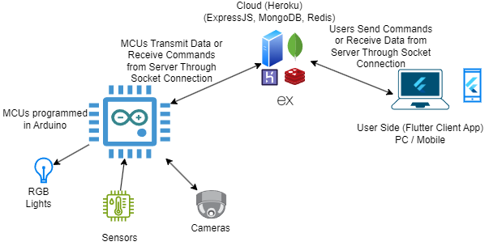

# Monitor.IoT 🌐📷💡🌡️
End-to-End Service for Monitoring & Controlling IoT Devices

# Team

- Sakka Mohamad-Mario: Cloud, Client App & Firmware  
- Zafar Azzam: Cloud, Firmware & Documentation

# Description

This is a smart things project which implements cameras, sensors and rgb lamps that can be easily controlled or monitored by users through an app that can run on any device as long as it's connected to the internet. Some of the key features are:

- Enables monitoring and controlling installed smart devices from anywhere in the world at any time
- User-friendly, very easy to setup and start using it, it only requires that devices stay connected to the internet
- Allows for multiple users simulataineously to connect on the same account at the same time or just have multiple users with different accounts using it at the same time

# Architecture

- Micorcontrollers (smart devices) equipped with cameras, connected to sensors or RGB lamps
- A client app that can run on mobile or PC
- An expressJS-based server hosted on Heroku, that handles socket connections in order to exchange data between the client app and MCUs by using Redis pub/sub channels
- A database hosted on MongoDB Atlas for storing user credentials

# Bill of Materials

| Device | Usage | Price                                                                                                                                                                                           |
|-|-|-|
| [RGB LED](https://static.optimusdigital.ro/55966-large_default/rgb-led-common-anode.jpg)| For RGB Lamps | [5 x 0.99 RON](https://www.optimusdigital.ro/en/leds/484-rgb-led-common-anode.html?search_query=0104210000005752&results=1) |
| [DHT22 Temperature & Humidity Sensor](https://static.optimusdigital.ro/65572-large_default/senzor-de-temperatura-i-umiditate-dht22.jpg) | Sensing Temperature & Humidity | [1 x 22.99 RON](https://www.optimusdigital.ro/en/temperature-sensors/1199-senzor-de-temperatura-i-umiditate-dht22.html?search_query=DHT22+Temperature+and+Humidity+Sensor&results=7) |
| [6Pin FTDI FT232RL FT232 Module - USB to TTL UART Serial Adapter](https://static.optimusdigital.ro/65779-large_default/6pin-ftdi-ft232rl-ft232-module-for-arduino-usb-to-ttl-uart-serial-wire-adapter-rs232.jpg) | Flashing Programs on ESP32-CAM & Debugging | [1 x 29.99 RON](https://www.optimusdigital.ro/en/level-shifters/12629-6pin-ftdi-ft232rl-ft232-module-for-arduino-usb-to-ttl-uart-serial-wire-adapter-rs232.html?search_query=0104110000084750%09&results=1) |
| [Set of Rigid Jumper Wires](https://ardushop.ro/9513-large_default/set-jumper-breadboard-140.jpg) | Connectivity | [1 x 9.64 RON](https://ardushop.ro/ro/fire-si-conectori/927-set-jumper-breadboard-140-6427854012340.html)  |
| [ESP32-CAM](https://ardushop.ro/10841-large_default/modul-esp32-cu-camera.jpg) | Live Video Feed | [1 x 54.94 RON](https://ardushop.ro/ro/comunicatie/1374-modul-esp32-cu-camera-6427854020031.html)  |                                                                   
| [Breadboard 830 Points](https://static.optimusdigital.ro/54847-large_default/breadboard-hq-830-points.jpg) | Connectivity | [1 x 9.98 RON](https://www.optimusdigital.ro/en/breadboards/8-breadboard-hq-830-points.html?search_query=Breadboard&results=362) |
| [ESP32](https://static.optimusdigital.ro/43669-large_default/esp32-development-board-with-wifi-and-bluetooth-42.jpg) | Processing Sensors Data & Controlling RGB Lamps | [1 x 34.99 RON](https://www.optimusdigital.ro/en/bluetooth-boards/4371-esp32-development-board-with-wifi-and-bluetooth-42.html?search_query=ESP32&results=38) |
| **TOTAL** | - | [**208.55 RON**] |

# Technical Details

Enter the directories for the different parts of the project (backend, frontend, firmware), and you will find there details about each one of them.

# Links

These are some links which inspired us to work on this project

- ESP32-CAM: https://www.youtube.com/watch?v=hSr557hppwY
- Temperature & Humidity Sensor (DHT22): https://randomnerdtutorials.com/esp32-dht11-dht22-temperature-humidity-sensor-arduino-ide/
- Hosting our Server on Heroku: https://www.freecodecamp.org/news/how-to-deploy-your-site-using-express-and-heroku/
- Using Redis Pub/Sub Channels: https://neelesh-arora.medium.com/setup-pub-sub-using-redis-and-express-f23a86d4f967
